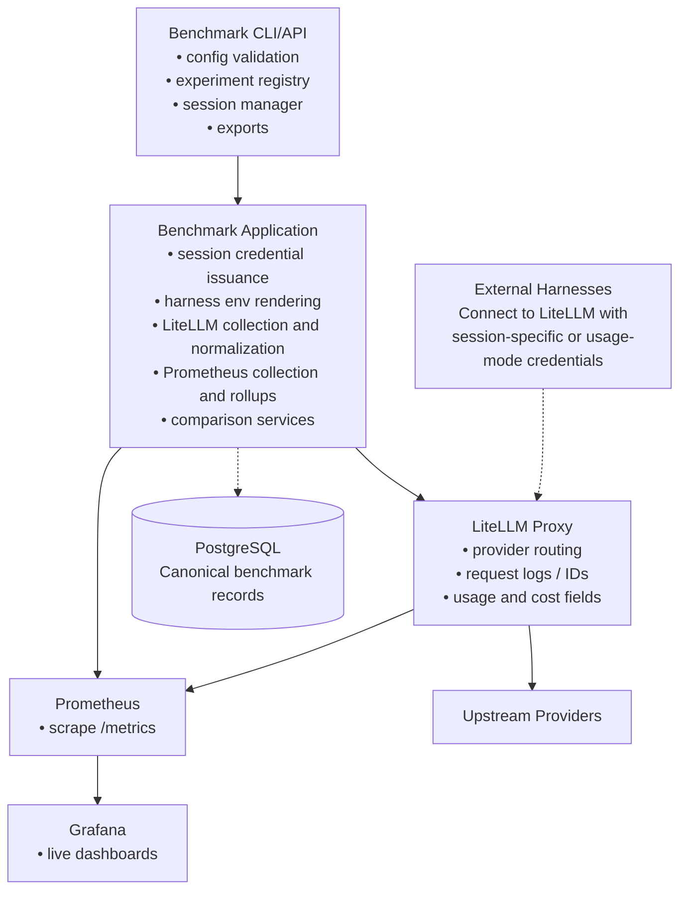

# Architecture

## System goal

Provide a single local platform that supports two complementary operating modes:

- **Benchmark mode**: interactive harness comparisons across experiments, variants, providers, and task cards. Every benchmark session is created before harness traffic starts.
- **Usage mode**: long-running API-key and model accounting for request volume, token usage, spend, latency, TTFT, errors, and cache behavior—without requiring an experiment, variant, task card, or session.

Both modes route traffic through one LiteLLM proxy. The platform captures comparable request-, session-, variant-, and experiment-level data in benchmark mode, and captures attributable usage records in usage mode, without embedding harness-specific runtime logic into the benchmark application.

## Component model

### 1. LiteLLM proxy

LiteLLM is the single inference gateway.

Responsibilities:

- expose protocol surfaces used by supported harnesses
- route traffic to configured providers and models
- emit request logs, request IDs, and usage data
- expose Prometheus metrics
- manage session-scoped and usage-mode proxy credentials and aliases

### 2. PostgreSQL

PostgreSQL stores the benchmark system's canonical records.

Responsibilities:

- benchmark metadata
- session lifecycle state
- normalized benchmark requests
- usage requests and rollups
- proxy key registry (non-secret metadata)
- derived rollups
- artifact index
- comparison query tables and views

### 3. Prometheus

Prometheus captures live proxy metrics and time-series snapshots.

Responsibilities:

- scrape LiteLLM metrics
- preserve raw time-series for operational dashboards
- feed derived rollups into benchmark summaries where needed

### 4. Grafana

Grafana is the live dashboard surface.

Responsibilities:

- request latency views
- TTFT views
- error-rate views
- cache and token panels
- benchmark-session dashboards

### 5. Benchmark application

The benchmark application owns benchmark-specific logic and usage-mode observability.

Responsibilities:

- typed config loading
- experiment and variant registry
- task-card registry
- session creation and finalization
- session-scoped proxy credential issuance
- usage-mode proxy key registry and issuance
- harness environment rendering
- collection and normalization jobs (benchmark and usage)
- rollup jobs (benchmark and usage)
- query API
- exports

### 6. External harnesses

Harnesses remain external tools.

Examples include terminal agents and IDE agents that can be configured with:

- proxy base URL
- proxy API key
- model name or route alias
- harness-specific environment variables

The benchmark application does not execute harness-specific business logic in the core path. It supplies connection details and benchmark metadata, then captures traffic through the shared proxy.

## Architecture diagram

**Notes:**
- External harnesses connect to LiteLLM with session-specific or usage-mode credentials.
- Canonical benchmark records and usage records are stored in PostgreSQL.
- `usage_requests` may optionally carry a `benchmark_session_id` when traffic includes session metadata.

## Benchmark mode data flow

1. Operator selects an experiment, variant, task card, and harness profile.
2. Benchmark application creates a `session` record.
3. Benchmark application issues a session-scoped LiteLLM credential and alias.
4. Benchmark application renders a harness-specific environment snippet.
5. Operator launches the harness manually and works on the task interactively.
6. Harness sends LLM traffic through LiteLLM.
7. LiteLLM emits request data and Prometheus metrics.
8. Collectors ingest raw proxy records and normalize them into canonical `requests` rows.
9. Rollup jobs compute request, session, variant, and experiment summaries.
10. Reports and dashboards expose comparisons.

**Invariant**: benchmark mode still requires session creation before harness traffic. Any shortcut that allows harness traffic before session registration breaks comparability.

## Usage mode data flow

1. Operator creates a usage-mode proxy key through the CLI or API, supplying `key_alias`, `owner`, `team`, `customer`, and optional metadata.
2. Benchmark application registers the key in the `proxy_keys` table (non-secret metadata only).
3. Operator configures any client or harness to use the proxy base URL and the usage-mode key.
4. Traffic flows through LiteLLM.
5. Collectors ingest LiteLLM spend logs and normalize them into `usage_requests` rows.
6. `usage_requests` rows store `proxy_key_id`, `key_alias`, `owner`, `team`, `customer`, `model`, `provider`, timing, tokens, errors, cache counters, and `cost` when available from LiteLLM spend logs.
7. If LiteLLM tags contain a benchmark `session_id`, the collector stores it as `benchmark_session_id` on the usage row for optional cross-mode joins.
8. Usage rollup jobs compute summaries by proxy_key_id, key_alias, model, provider, owner, team, customer, and time bucket.
9. Usage dashboards and exports expose key-level and model-level summaries.

**Invariant**: usage mode works without experiment, variant, task card, or session. Session metadata is optional usage metadata, not a prerequisite.

## Why the system is harness-agnostic

The benchmark application only needs three harness-specific facts:

- which proxy protocol surface the harness uses
- which environment variables or config fields must be set
- which benchmark tags or model fields need to be injected

Those facts live in harness profile configuration. The core runtime remains the same no matter which harness is being benchmarked.

## Canonical comparison dimensions

Every normalized request and every session summary must preserve these dimensions:

- provider
- provider route
- model
- harness profile
- harness configuration fingerprint
- experiment
- variant
- task card
- session
- git commit
- timestamp window

## Credential and tagging strategy

The benchmark application should issue one proxy credential per session.

Required properties:

- short TTL
- key alias that encodes or references the session
- metadata fields for experiment, variant, harness profile, and task card
- local operator visibility into the exact values used for the session

This design gives strong correlation even when a harness cannot send custom headers.

## Source-of-truth boundary

The benchmark database is the reporting schema.

Source systems feed the benchmark database:

- LiteLLM request rows, callbacks, or structured logs
- Prometheus snapshots and derived calculations
- benchmark session registry metadata

This boundary protects the project from changes in LiteLLM internals and keeps queries stable.

## Repository and git metadata capture

Sessions must capture repository context because benchmark sessions are tied to codebase work.

Capture at session start:

- absolute repository root
- active branch
- commit SHA
- dirty state
- task-card identifier
- operator label if provided

## Deployment posture

Use one local Docker Compose stack for:

- LiteLLM
- PostgreSQL
- Prometheus
- Grafana

Run the benchmark application natively with `uv` so development remains fast and the CLI can inspect the local filesystem and git state directly.
